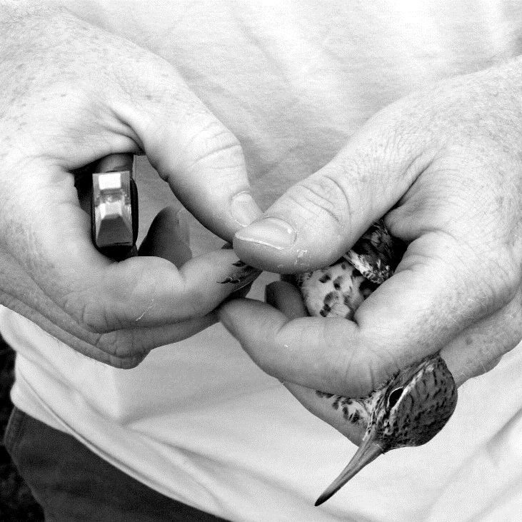

```{r, include=FALSE}
knitr::opts_chunk$set(
  results='asis', 
  echo = FALSE
)

library(tidyverse)
library(glue)

# Set this to true to have links turned into footnotes at the end of the document
PDF_EXPORT <- FALSE

# Holds all the links that were inserted for placement at the end
links <- c()

source('parsing_functions.R')

# Load csv with position info
position_data <- read_csv('positions_ads.csv')
```


```{r}
# When in export mode the little dots are unaligned, so fix that. 
if(PDF_EXPORT){
  cat("
  <style>
  :root{
    --decorator-outer-offset-left: -6.5px;
  }
  </style>")
}
```


Aside
================================================================================

{width=100%}

```{r}
# cat("View this CV online with links at [_adamdsmith.me/cv/cv.html_](http://adamdsmith.me/cv/cv.html)")
cat("[<i class='fas fa-download'></i> Download this CV as a PDF](https://github.com/adamdsmith/adamdsmith/raw/master/static/cv/adamdsmith_cv.pdf)")
```

Contact {#contact}
--------------------------------------------------------------------------------

- <i class="fa fa-envelope"></i> [avianmigration@gmail.com](mailto:avianmigration@gmail.com)
- <i class="fa fa-github"></i> [github.com/adamdsmith](http://github.com/adamdsmith)
- <i class="fa fa-link"></i> [adamdsmith.me](http://adamdsmith.me/)
- <i class="ai ai-google-scholar"></i> [Google Scholar](http://scholar.google.com/citations?user=7I5SC8wAAAAJ&hl=en)
- <i class="fa fa-twitter"></i> [avianmigration](http://twitter/com/avianmigration)

Skills {#skills}
--------------------------------------------------------------------------------

- <i class="fab fa-r-project"></i> R
- <i class="fa fa-broadcast-tower"></i> Digital telemetry
- <i class="fa fa-feather"></i> Bird banding (master)
- <i class="fas fa-laptop"></i> Data analysis
- <i class="fa fa-github"></i> GitHub
- <i class="fab fa-markdown"></i> Markdown

Disclaimer {#disclaimer}
--------------------------------------------------------------------------------

Made with [**pagedown**](https://github.com/rstudio/pagedown). 

Source code on [github](https://github.com/adamdsmith/adamdsmith/tree/master/static/cv).

Last updated: `r Sys.Date()`.


Main
================================================================================

Adam D. Smith {#title}
--------------------------------------------------------------------------------


```{r}
intro_text <- "As a Quantitative Ecologist with the [United States Fish & Wildlife Service Inventory and Monitoring Program](https://www.fws.gov/southeast/national-wildlife-refuges/inventory-and-monitoring/), I provide ecological inventory and monitoring design and analytical assistance to the roughly 130 National Wildlife Refuges. In addition, I engage in diverse partnerships with conservation and resource management agencies and organizations to support a research program built around modern quantitative tools and approaches to understand the ecology and conservation of migratory animals. Most of my active projects are collaborative and integrate digitally-coded telemetry or GPS logging technology to answer landscape and local scale questions relevant to conservation and management. I am an open science advocate."

cat(sanitize_links(intro_text))
```


Education {data-icon=graduation-cap data-concise=true}
--------------------------------------------------------------------------------

```{r}
print_section(position_data, 'education')
```


Professional Experience {data-icon=suitcase}
--------------------------------------------------------------------------------

```{r}
print_section(position_data, 'professional_positions')
```


<!-- Industry Experience {data-icon=suitcase} -->
<!-- -------------------------------------------------------------------------------- -->

<!-- ::: aside -->
<!-- I have worked in a variety of roles ranging from journalist to software engineer to data scientist. I like collaborative environments where I can learn from my peers.  -->
<!-- ::: -->

<!-- ```{r} -->
<!-- print_section(position_data, 'industry_positions') -->
<!-- ``` -->

<!-- <br> -->
<!-- <br> -->
<!-- <br> -->


Publications {data-icon=book}
--------------------------------------------------------------------------------

```{r}
print_section(position_data, 'publications')
```

Software {data-icon=laptop}
--------------------------------------------------------------------------------

```{r}
print_section(position_data, 'software')
```

Grants {data-icon=money-bill}
--------------------------------------------------------------------------------

> NOTE: asterisks (\*) indicate integral contribution to project development, design, and implementation, but institutional policies prevented inclusion as a PI.

```{r, eval=TRUE}
print_section(position_data, 'grants')
```

Teaching {data-icon=chalkboard-teacher}
--------------------------------------------------------------------------------

<!-- ::: aside -->
<!-- I am passionate about education. I believe that no topic is too complex if the teacher is empathetic and willing to think about new methods of approaching task. -->
<!-- ::: -->

```{r}
print_section(position_data, 'teaching_positions')
```

Invited Talks {data-icon=chalkboard-teacher}
--------------------------------------------------------------------------------

```{r, eval=TRUE}
print_section(position_data, 'presentations_invited')
```

Contributed Talks {data-icon=chalkboard-teacher}
--------------------------------------------------------------------------------

```{r, eval=TRUE}
print_section(position_data, 'presentations')
```

Advising {data-icon=comment}
--------------------------------------------------------------------------------

```{r, eval=TRUE}
print_section(position_data, 'advisory_positions')
```

<!-- References -->
<!-- -------------------------------------------------------------------------------- -->

```{r, eval=FALSE}
print_section(position_data, 'references')
```

```{r, eval=FALSE}
if(PDF_EXPORT){
  cat("
  
Links {data-icon=link}
--------------------------------------------------------------------------------

<br>


")
  
  walk2(links, 1:length(links), function(link, index){
    print(glue('{index}. {link}'))
  })
}
```


